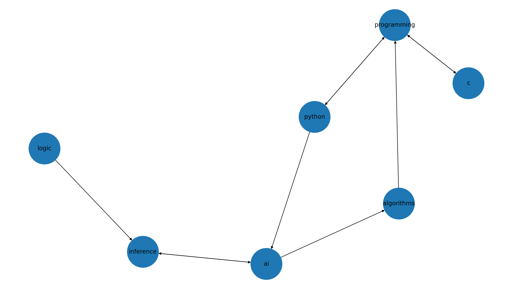
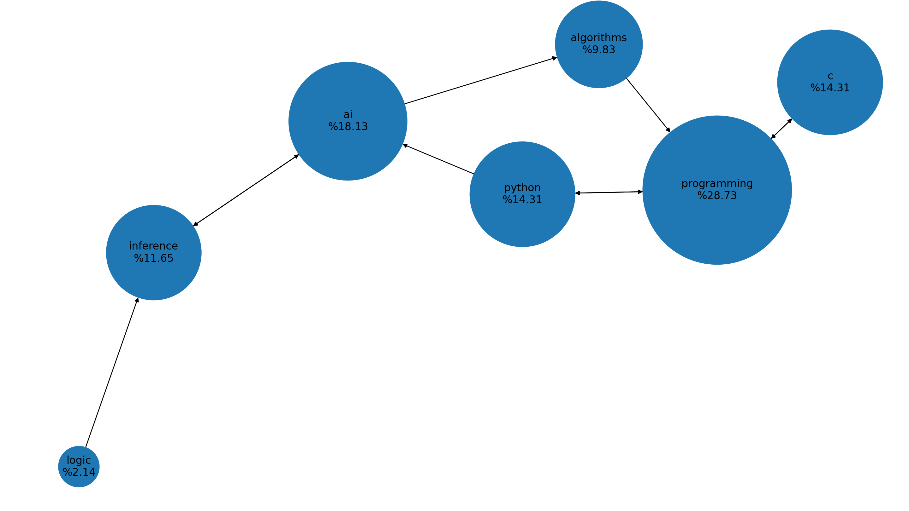

# Pagerank
Google'ın 96-2014 yılları arasında sayfaların güvenilirlik puanlarını hesaplamak için kullandığı Pagerank algoritmasının graf teorisiyle örnek veriseti görselleştirilmesi.

### Kullanım

```shell
pip3 install -r requirements.txt
python3 pagerank.py
```


### Çıktılar


**Html sayfaları ve link verdiği sayfalara göre oluşan graf.**




**Pagerank değerlerine göre boyutları ayarlanmış graf.**



